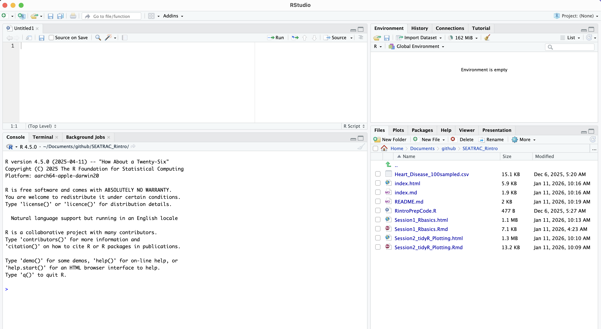

```{r setup, include=FALSE}
knitr::opts_chunk$set(echo = TRUE)
#knitr::opts_chunk$set(fig.path = 'figures/')
##set working dir to project
#knitr::opts_knit$set(root.dir = #rprojroot::find_rstudio_root_file())
```

# Before starting
Please try to download and install R and RStudio prior to the workshop sessions with the following steps:

1. Download and install R: [download link](https://cran.r-project.org/)
2. Download and install Rstudio: [download link](https://posit.co/download/rstudio-desktop/)

You should also try to download the toy dataset that we will be using to demonstrate some concepts in these workshops:
[Heart_Disease_100sampled.csv](https://github.com/Ma-Lab-Seattle-Childrens-CGIDR/SEATRAC_Rintro/raw/refs/heads/main/Heart_Disease_100sampled.csv). 

(Note: this spreadsheet is a sub-sampled dataset from [kaggle](https://www.kaggle.com/datasets/oktayrdeki/heart-disease/data).)

# Overview
In this workshop, we'll introduce you to some R fundamentals:

* R data types (numbers, strings, logicals)
* Importing data from a spreadsheet into a data frame / tibble
* Subsetting data frames / tibbles
* Introduction to packages

## A Tour of RStudio

We will do all of our work in [RStudio](https://www.rstudio.com/). RStudio is an integrated development and analysis environment for R that brings a number of conveniences over using R in a terminal or other editing environments.

When you start RStudio, you will see something like the following window appear:



Notice that the window is divided into four "panes":

- Console (the left bottom): This is your view into the R engine. You can type in R commands here and see the output printed by R. (To make it easier to tell them apart, your input and the resulting output are printed in different colors.) There are several editing conveniences available: use up and down arrow keys to go back to previously entered commands, which can then be edited and re-run; TAB for completing the name before the cursor; see more in [online docs](http://www.rstudio.com/ide/docs/using/keyboard_shortcuts).

- Environment/History (tabbed in upper right): View current user-defined objects and previously-entered commands, respectively. The instructor may have additional tabs like Connection, Git, etc. These are not relevant to this workshop series.

- Files/Plots/Packages/Help (tabbed in lower right): As their names suggest, these are used to view the contents of the current directory, graphics created by the user, install packages, and view the built-in help pages.

- R script (left top): this is where you can save your code in a .R script file for future use. R script files are the primary way in which R facilitates reproducible research. R scripts maintain a record of everything that is done to the raw data to reach the final result. That way, it is very easy to write up and communicate your methods because you have a document listing the precise steps you used to conduct your analyses. 

To change the look of RStudio, you can go to Tools -> Global Options -> Appearance and select colors, font size, etc. If you plan to be working for longer periods, we suggest choosing a dark background color scheme to save your computer battery and your eyes.

## R scripts

Generally, if you are testing an operation (*e.g.* what would my data look like if I applied a log-transformation to it?), you should do it in the console (left pane of RStudio). If you are committing a step to your analysis (*e.g.* I want to apply a log-transformation to my data and then conduct the rest of my analyses on the log-transformed data), you should add it to your R script so that it is saved for future use. 

**Important:** You should annotate your R scripts with comments. In each line of code, any text preceded by the `#` symbol will not execute. Comments can be useful to remind yourself and to tell other readers what a specific chunk of code does. In my experience, there can never be too much commenting. 

Let's create an R script `(File > New File > R Script)` and save it as `introR_live_notes.R` in your main project directory. If you again look to the project directory on your computer, you will see `introR_live_notes.R` is now saved there. We will work together to create and populate the `introR_live_notes.R` script throughout this workshop. 

# Basic data types
With R open, you will see a prompt '>' in the Console area (bottom left). Enter anything after this prompt, and R will try and evaluate it. R can evaluate 3 types of data:

* numbers and mathematical expressions
* quoted text (strings) 
* logical expressions (TRUE and FALSE are special values in R)

## Numbers
Calculator operations work with numbers.

```{r doubles}

# We are also assigning the answer to a variable we are calling a
a <- 1 + 1

# calling on a will give back the answer
print(a)

```

## Logicals

R calls conditionals "logicals". We can use operations that test whether something is TRUE or FALSE, which will output conditionals. 

```{r logicals}
3 < 5

4 < 2

#To test equality, you have to use two equals signs. You can use parentheses for operations
(3 + 3) == (2 + 4)

# To test for non-equality
4 != 3 
```

Note: when you want to compare 2 conditionals, you can test if both are true with the AND operator "&", and you can test if either one of the conditionals are true with the OR operator "|"
```{r AND/OR}
(3 < 5) & (4 < 2) #AND

(3 < 5) | (4 < 2) #OR
```

## Strings

R can work with text in the form of strings. Note that R will register anything put between "" or '' as a string, even numbers. But the operations R can perform on strings differ from those on numbers

```{r strings}
"Hello"

"Hello" == "Hello"

"Hello" == "Hello "

"Hello" == "hello"

```

```{r string error, echo=FALSE}
#'1'+'1'
#Error in "1" + "1" : non-numeric argument to binary operator
```

## Lists
Lists are a grouping of multiple entries of data. Can comprise of any data type
```{r list}
numlist = c(1,3,4,9)
numlist + 2
numlist > 3

# a shortcut
numrange = 1:4
print(numrange)

# a list of strings
wordlist = c('blue','red','white','green')
# can test if something is in a list:
'red' %in% wordlist

```

You can tell R to extract/subset specific elements of a list using square brackets 

```{r subsets}
numlist[2]
numlist[c(2,4)]
```

Importantly, you can subset based on conditionals, and embed conditional operations.
```{r conditional subsets}
print(numlist)
logiclist = c(TRUE,FALSE,TRUE,FALSE)
numlist[logiclist]
numlist[numlist < 5]
```


# Installing Packages in R
Many people have developed analysis tools for R that are not available in the base software. Instead, we can access these tools by downloading and installing packages. 

Installations only need to happen once.

```{r install}
#install.packages("tidyverse")
```

But you need to load the package every time you open R to access the tools provided in the package:

```{r library}
library(tidyverse)
```

# Data importing

We will use the tidyverse function `read_csv()` to import our spreadsheet into R as a tibble.

You will first need to navigate to the directory where you have downloaded our toy dataset, which can be done with the Dropdown menu: `Session > Set Working Directory`, or with the r command `setwd()`.
```{r import}
data = read_csv('Heart_Disease_100sampled.csv')
```

The spreadsheet dimensions can be queried by `dim`, `nrow`, and `ncol`
```{r data frame dimensions}
# tells number of rows (1st) and columns (2nd)
dim(data)

# nrow tells how many rows 
nrow(data)

#ncol tells how many columns
ncol(data)
```

R Studio: you can view a spreadsheet summary of the data with 
`View()`. `You can also see a summary of the data with `str()`
```{r viewing the data}
#View(data)

# viewing the top rows, columns 
str(data)
```

# Extracting data subsets
To select rows and columns together, use single brackets and two indices: [row, column].
```{r slicing data}
# Return the value at the first row, third column
data[1,4]

# You can also use lists:
# First 3 rows, first 2 columns
data[1:3, 1:2]

# all of columns in row 3
data[3,]

# all of rows in column 1
data[,1]
```

You can also call on specific columns by name.

```{r column slicing}
data$BMI
data[,'BMI']
```

Importantly, you can also subset based on conditionals

```{r conditional slicing}
HeartDiseaseRows = data$`Heart Disease Status` == 'Yes'
print(HeartDiseaseRows)
data[HeartDiseaseRows,'BMI']
```

## Example application: statistical testing with data subsets
This kind of subsetting enables you to perform comparative analyses.

As an example, we will perform a t-test, comparing the distribution of BMI in patients with and without heart disease. The R command for performing a standard Student's t-test is `t.test()`:

```{r ttest HD}
t.test(data[data$`Heart Disease Status` == 'Yes','BMI'],data[data$`Heart Disease Status` == 'No','BMI'])
```

# Getting help
To get more information on a function, use the ? operator. This brings up a help page describing how the function works. These pages can be pretty dense and technical, even for longtime R users, so don't be discouraged if it's hard to understand
```{r help ex}
?t.test()
```


To see an example of how a function is used, try the 'example' function. Not every function has examples though!
```{r example}
example(t.test)
```
Note: Searching with a specific question will also return many useful tutorials online.

### Bonus example: a Linear Model associating BMI with different factors

Clinical data are often analyzed by linear regression analyses. In R, the command to perform an ordinary least squares linear model is `lm()`. The `summary()` function reports several result outputs from the linear model. 

```{r linear model BMI}
IndepVar = data$BMI
FactorGender = as.factor(data$Gender)
FactorSmoking = as.factor(data$Smoking)
FactorExercise = as.factor(data$`Exercise Habits`)

BMImodel = lm(IndepVar ~ FactorGender + FactorSmoking + FactorExercise)

summary(BMImodel)
```

To see more functionality associated with the `lm` function, we can see the example report:
```{r lm example}
example(lm)
```

